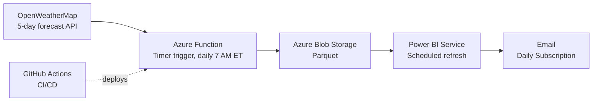

# 33L


I live in Everett, MA — about three miles north of Boston Logan International Airport. When winds shift northwesterly, Logan reconfigures to use **runway 33L for departures and 4R for arrivals**, routing aircraft directly over my neighborhood at roughly 1,500 ft. Some days are quiet. Some are not.

This project predicts which days and hours will be loud, three days ahead, using forecast wind direction. A daily Power BI report tells me when to stay home.

## Architecture



A timer-triggered Azure Function runs daily, pulls the wind forecast for Logan from OpenWeatherMap, applies a rule-based model mapping wind direction to runway 33L likelihood, and writes hourly predictions to Azure Blob Storage. Power BI reads the blob on a scheduled refresh and emails the report each morning.

## The rule

Runway 33L is favored when winds are out of the northwest:

| Wind direction | Likelihood | Confidence |
|---|---|---|
| 290°–360° / 0° | High | 100% |
| 280°–289° | Possible | 80% |
| 275°–279° | Possible | 65% |
| 265°–274° | Possible | 50% |
| All other | Unlikely | — |

This is a hand-tuned approximation of FAA runway selection logic at KBOS.

## Output

- **Window:** 3 days ahead, hours 7 AM through 11 PM local
- **Granularity:** one row per hour (interpolated from the API's 3-hour buckets)
- **Format:** Parquet in Azure Blob Storage
- **Refresh:** daily at 7 AM Eastern

## Stack

- **Compute:** Azure Functions (Python 3.13, Flex Consumption plan, Linux)
- **Storage:** Azure Blob Storage (Parquet)
- **Reporting:** Power BI Service with scheduled refresh and email subscription
- **CI/CD:** GitHub Actions, tests + deploy on push to `main`
- **Data:** OpenWeatherMap 5-day/3-hour forecast API

## Local development

```bash
python -m venv .venv
.venv\Scripts\activate
pip install -r requirements.txt
func start
```

## Tests

```bash
pytest tests/ -v
```

## Roadmap

- [ ] Validate predictions against OpenSky ADS-B observations
- [ ] Calibration plot (predicted P vs. observed frequency)
- [ ] Replace rule-based model with logistic regression once enough labeled data exists
- [ ] Add wind speed as a feature

## License

MIT